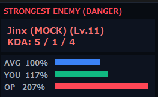
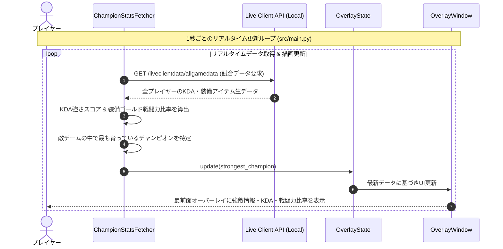

# LoL OP Checker

`lol-op-check` は、League of Legends (LoL) の試合中、**ローカルで起動しているゲームEXEが提供するAPIからリアルタイムに試合データを取得**し、敵チームの中で最も育っている（キャリーしている）危険なチャンピオンを特定してゲーム画面上に最前面でオーバーレイ表示するサポートツールです。

一目で「今誰を警戒すべきか」「その敵が現在デスしているか（あと何秒で復活するか）」を把握し、戦術的な判断を支援します。

<p align="center">
  
</p>

---

## 主な機能 (Features)

1. **「最強の敵」をリアルタイム特定**
   - 敵チーム全員のリアルタイムKDAを監視し、現在の強さ評価スコアを算出して最も警戒すべき敵チャンピオンを特定・表示します。
2. **復活カウントダウン（デスタイマー）**
   - 警戒対象の敵がデスした際、オーバーレイ全体を自動的にグレーアウトし、**復活までの残り秒数**をカウントダウン表示します（例: `Jinx (Lv.12) [DEAD (18s)]`）。
3. **表示の自動制御**
   - **全員 0/0/0 の時は非表示**: 試合開始直後など、誰もキル/アシストに関与していない状態では、表示を非表示（待機状態）にします。
   - **ゲーム終了時の自動リセット**: 試合が終了すると即座に検知し、表示をクリアして待機状態に戻ります。
4. **最前面のオーバーレイ表示**
   - 枠線やタイトルバーのないダークテーマのウィンドウ。
   - ドラッグ操作による位置移動、右上 [✕] ボタンによる終了に対応。

---

## 動作環境 (Requirements)

- **OS**: Windows
- **Python**: `>=3.13`
- **パッケージ管理**: `uv` (推奨)

---

## クイックスタート (Usage)

### 1. 起動準備
LoL クライアントを起動し、ゲーム内にいる（または試合開始前である）ことを確認します。

### 2. ツールの起動
PowerShell を開き、プロジェクトルートで以下の起動スクリプトを実行します。

```powershell
./run.ps1
```

または、`uv` コマンドで直接実行することも可能です。

```bash
uv run src/main.py
```

### 3. 操作方法
- **左ドラッグ**: オーバーレイウィンドウを画面上の任意の場所に移動できます。
- **右上 [✕] ボタン**: オーバーレイウィンドウを終了します。

---

## データ取得の仕組み & 技術仕様

### 1. ローカルゲームEXEのAPIによるリアルタイムデータ取得
本ツールは、試合中にローカルPC上で動作する **League of Legends ゲーム実行ファイル（`League of Legends.exe`）が公式に提供する Live Client Data API** からリアルタイムにデータを直接取得しています。

- **エンドポイント**: `https://127.0.0.1:2999/liveclientdata/allgamedata`
- **データ取得間隔**: 1秒間隔でポーリング（接続プールを最適化して低負荷で動作）
- **安全・クリーンな設計**:
  - メモリの直接読み取りやプロセス改ざん（チート行為）は一切行いません。
  - 外部の中継サーバー等を経由せず、自身のPC内（ローカル通信 `127.0.0.1`）でのみ完結します。
  - Riot Games 公式がサードパーティ製ツール向けに仕様公開している正規のローカルエンドポイントのみを利用しています。

### 2. 強さスコアの算出式
敵プレイヤーの強さは、以下の計算式に基づいてリアルタイム算出されます。

$$\text{Score} = (\text{Kills} \times 3) + (\text{Assists} \times 1) - (\text{Deaths} \times 2)$$

※ このスコアが最も高い敵チャンピオンを「最強の敵（警戒対象）」として自動特定します。また、自チームの平均装備ゴールドに対する倍率から戦闘力比率を計算し、バーグラフで可視化します。

---

## 処理フロー (Sequence Diagram)



---

## プロジェクト構造

- [src/main.py](./src/main.py) - アプリケーションのエントリーポイントとポーリングの制御ループ。
- [src/data_fetcher.py](./src/data_fetcher.py) - Live Client API からのデータ取得、最強の敵の特定ロジック。
- [src/overlay.py](./src/overlay.py) - Tkinter を使用したオーバーレイ UI の描画およびイベント処理。
- [scripts/build.py](./scripts/build.py) - PyInstaller による単一 EXE ビルドスクリプト。
- [.github/workflows/release.yml](./.github/workflows/release.yml) - GitHub Actions による Windows EXE 自動ビルド・リリース設定。
- [pyproject.toml](./pyproject.toml) - プロジェクトの依存関係定義。
- [run.ps1](./run.ps1) - 起動用 PowerShell スクリプト。
